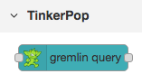
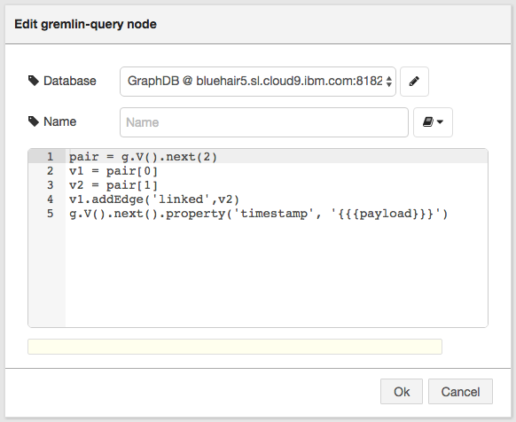
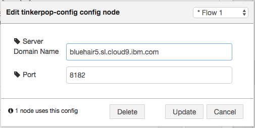

## node-red-contrib-tinkerpop 

npm install node-red-contrib-tinkerpop -g

Provides a few nodes to connect to TinkerPop graph databases using Gremlin.

A Groovy language editor is supplied for your Gremlin scripts:

You can target any GremlinServer instance you like:

See http://tinkerpop.apache.org/docs/3.1.1-incubating/reference/ for Apache Tinkerpop documentation.
